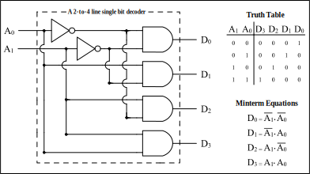
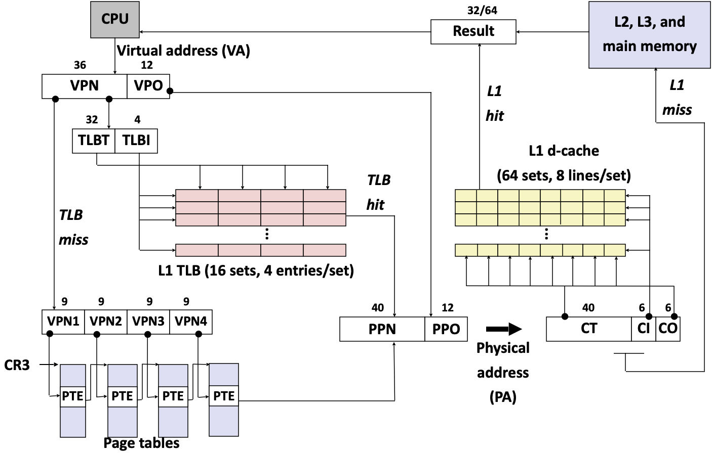

# **6.004 Computation Architecture**

# <u>Summary</u>

这门课程从场效应晶体管 FET（一种放大或转换电子信号和电压的半导体）作为数字（digital）信号的物理实现开始，逐步构建出一台完整的现代计算机。

这门课巨大的优势是没有使用实践工具和语言（如X86、RISC-V、ARM指令集，或是Bluespec作为电路设计的语言）。作为计算机科学而非软件工程的本科课程，这种方式对于概念的理解是异常有效的。

教学团队为此开发了Jade用来模拟电路（电路，硬件），BSim用来模拟Beta Instruction（指令集，软件），以及TMSim用来模拟图灵机。

几个lab使用Jade：

- 一步步构建出了一个完整的CPU的电路（Lab1/2/3/4/7）
	1. 使用MOSFET设计一个组合逻辑电路 Combinational Logic（Lab1）
	2. 使用MOSFET设计反向逻辑门，再通过逻辑门设计一个全加器 Full Adder（Lab2）
	3. 通过存储模块和Register模块设计一个有限状态机 Finite State Machine/时序逻辑电路 Sequential Logic（Lab3）
	4. 通过逻辑门、MUX和FA设计出算术逻辑单元（ALU，组合逻辑电路）的几个部分：按位逻辑/布尔、比较、算数、移位，并组合成完整的ALU（Lab4）
	5. 设计Program Counter，Register File，和Control Logic，并和ALU及Memory一同构成一个完整的现代计算机（不含I/O）
- 使用存储模块练习了Cache电路的构建（Lab8）

另外的lab通过BSim介绍和练习了：

- 使用堆栈的子程序处理（Lab6）
- 如何通过硬件的非法指令处理机制在软件层面编写新的指令（Lab9）
- 通过操作系统的Kernel实现一个分时系统（timesharing）进行多进程（process）及I/O的处理（Lab10）

# <u>Review</u>

## 信息基础

### 信息

- 信息的量化
	- $I\left(x_{i}\right)_{bit}=\log _{2}\left(\frac{1}{p_{i}}\right)$
- 信息熵
	- $H(X)=E(I(X))=\sum_{i=1}^{N} p_{i} \cdot \log _{2}\left(\frac{1}{p_{i}}\right)$

### 编码（encoding）

- 看作二叉树的编码
	- 符号看作叶节点（leaves）
- 固定长度编码
	- 信息熵：$\sum_{i=1}^{N}(1 / N) \log _{2}\left(\frac{1}{1 / N}\right)=\log _{2}(N)$
- 变长度编码
	- 霍夫曼算法（Huffman）：尽量减少信息熵
- 错误检测与纠正
	- 汉明距离
	- 奇偶校验位

## 数字抽象

### 使用电压代表信息

- 噪声/错误宽容度
	- 从模拟到数字

### 组合器件（combinational device）

- static discipline（静态纪律）
	- 功能规格（functional specification）：如输入到输出的真值表（无state）
	- 数字输入（一个或多个）和输出（一个或多个）
	- 定时规格（timing specification）
- 组合逻辑电路（combinational logic）
	- 无定向环（directed cycle）
	- “[它的任一时刻的稳态输出，仅仅与该时刻的输入变量的取值有关，而与该时刻以前的输入变量取值无关](https://zh.wikipedia.org/wiki/%E7%BB%84%E5%90%88%E9%80%BB%E8%BE%91%E7%94%B5%E8%B7%AF)”

### 处理噪声

- 噪声边际（noise margin）
	-    ​	
	- V~OL~ < V~IL~ < V~IH~ < V~OH~
- 电压转换曲线（VTC）
	-    ​	
	- 组合器件的增益必须大于1，并且是非线性的
		- 推论：人们不能用电阻、电容和电感建立组合逻辑，因为它们不是有增益的设备（它们是线性的）。

## CMOS

### MOSFET

-    ​	
- 金属氧化物半导体场效应晶体管 metal-oxide-semiconductor field-effect transistors
	- NFET：n型源/漏扩散在p型衬底中。正的阈值电压；反转形成n型通道 
	- PFET：n型衬底中的p型源/漏扩散。负阈值电压；反转形成p型通道。

### CMOS

- 将MOSFETs的行为建模为简单的电压控制开关。

	- 规则#1：只在下拉电路中使用NFET
	- 规则#2：只在上拉电路中使用PFET
- 互补的上拉和下拉
	- 当上拉器处于 "关闭 "状态时，下拉器应处于 "打开 "状态，反之亦然。
- CMOS优势
	- 高增益VTC
		- 巨大的噪音余量
	- V~OL~ ~ 0V, V~OH~ ~ V~dd~
		- 无静态功率
- 通用CMOS门的配方
	1. 想出能达到你想要的效果的上拉网络
		- （如果难以使用上拉网络产生高电压，则设计一个互补的逻辑门，并首先设计下拉网络，最后将该逻辑门连接INVERTER）
	2. 用pfets替换nfets，用并联子网替换串联子网，用串联子网替换并联子网，走完这个层次结构
	3. 将步骤1的pfet上拉网络与步骤2的nfet下拉网络结合起来，形成一个完全互补的CMOS门
- CMOS 定时规格
	- 传播延迟：上限
		-    ​	
	- 污染延迟：下限
		-    ​	

## 组合逻辑电路（Combinational Logic）的综合

- 功能规格
	- 真值表
	- 布尔表达式

### 一种设计方法

1. 将功能规格写成一个真值表
2. 写下一个布尔表达式，其条目涵盖了输出中的每个'1'。
3. “乘积之和”构件

### 更多构件

- NAND，NOR
	- CMOS门是自然反转的。想在CMOS设计中使用NAND和NOR......但NAND和NOR操作不是关联的
	- 通用：任何逻辑功能都可以只用NANDs（或等价于NORs）来实现。
- XOR
	- 实现奇偶校验和算术逻辑
	- 也可作为 "可编程的反相器 "使用：如果A=0，Z=B；如果A=1，Z=~B

### 布尔式最小化

$\begin{align} &Y=\bar{C} \bar{B} A+C B \bar{A}+C B A+\bar{C} B A \\ &Y=\bar{C} \bar{B} A+C B+\bar{C} B A \\ &Y=\bar{C} A+C B \end{align}$

### 卡诺图（Karnaugh Maps）

- 植入式 implicant（大小：2的幂），覆盖所有的1
- Leniency

### 多路复用器（Multiplexer）

-    ​	
-  Leniency
	-    ​	
- 可以系统地执行任何逻辑
	- 如：FPGA（现场可编程逻辑门阵列 Field Programmable Gate Array）

### 译码器（Decoder）

-    ​	
- ROM（只读存储器 Read-only memory）
	-   ​	
	- 如：BIOS（基本输入输出系统 Basic Input/Output System）

## 时序逻辑电路（Sequential Logic）

-   ​	

### 存储器

- 使用电容
	- 不稳定 $\longrightarrow$ 刷新
	- 如：DRAM
- 使用反馈
	-   ​	
- 可设置的记忆元素
	- 锁存器/闩锁 Latch：使用lenient MUX
		-   ​	

### D 锁存器（D for Data input）

- 示意符号： 
- Dynamic Discipline（动态纪律）
	-   ​	
	- 定时 timing：详见本讲Thinking
		- T~SETUP~ = 2T~PD~: G转换前的时间间隔，D必须是稳定和有效的
		- T~HOLD~ = T~PD~: G转换后的间隔，D必须是稳定和有效的

### D 寄存器/触发器（flip-flop/FF）

-   ​	
- 示意符号： 
- 定时：详见本讲Thinking
	- t~PD~：最大传播延迟，CLK→Q
	- t~CD~：最小污染延迟，CLK→Q 
	- t~SETUP~：设置时间 
		- 保证在master关闭之前，D已经通过反馈路径传播了
	- t~HOLD~：保持时间 
		- 保证在允许D发生变化之前，master已经关闭，数据稳定。

### 单时钟同步电路（Single-clock Synchronous Circuits）

-   ​	
- 定时：详见本讲Thinking
	-   ​	
	- t~1~ = t~CD,reg1~ + t~CD,L~ ≥ t~HOLD,reg2~
	- t~2~ = t~PD,reg1~ + t~PD,L~ + t~SETUP,reg2~ ≤ t~CLK~

### 时序逻辑电路定时

-   ​	
- 详见本讲Thinking
	- 对逻辑的t~CD~的约束？
		- t~CD,L~ ≥ t~H,R~ - t~CD,R~
	- 最小时钟周期？
		- t~CLK~ ≥ t~PD,R~ + t~PD,L~ + t~S,R~ 
	- 输入的设置、保持时间？
		- t~S,INPUT~ = t~PD,L~ + t~S,R~ 
			(以满足寄存器的设置时间)
		- t~H,INPUT~ = t~H,R~ - t~CD,L~
			(以满足寄存器的保持时间)

### *Thinking*

- Timing 定时
	- D Latch
		- setup：两倍的propagation delay，使得输出（Q）稳定，然后反馈（Q’）稳定
		- hold：一倍的propagation delay，等待G（gate，即clock）改变的稳定
	- (Edge-Triggered) D Register
		- T~PD~, T~CD~
		- T~SETUP~：在master关闭以前，保证D已经传播通过反馈路线（Q和Q’）
		- T~HOLD~：在D改变以前，保证master关闭且（clock干扰后的）数据稳定
	- Single-clock System
		- t~CD,reg1~ + t~CD,L~ ≥ t~HOLD,reg2~
			- CLK的rising edge（同时master关闭）后，寄存器1和逻辑块的污染延迟之和要大于等于寄存器2的hold，保证寄存器2中master的（clock干扰后的）Q已经稳定
		- t~PD,reg1~ + t~PD,L~ + t~SETUP,reg2~ ≤ t~CLK~
			- CLK的rising edge后，寄存器1和逻辑块的传播延迟加上寄存器2的setup之和，要小于时钟周期，保证CLK再次打开时，寄存器2中master的D已经传播通过反馈路线（Q和Q’）
	- Sequential Circuit
		- 相当于Single-clock System中的寄存器1和2都由单个寄存器承担
		- t~S,INPUT~ = t~PD,L~ + t~S,R~ 
			- 输入的setup要大于等于逻辑块的传播延迟加上寄存器的setup，保证寄存器D的setup时间
		- t~H,INPUT~ = t~H,R~ - t~CD,L~
			- 输入的hold要大于等于寄存器的hold减去逻辑块的污染延迟，保证寄存器D的hold时间

## 有限状态机

- 状态转换图解
	-    ​	
	- e.g. 锁
		-    ​	
		- 作为真值表
			-    ​	
		- 硬件
			-    ​	
			- Alternative:

### Lab3

- 图灵机（FSM+Memory）

	- > ......以无限的带子形式获得的无限的记忆容量，标记成方块，在每个方块上可以打印一个符号。在任何时候，机器中都有一个符号；它被称为扫描的符号。机器可以改变扫描的符号，其行为在一定程度上由该符号决定，但带子上其他地方的符号并不影响机器的行为。然而，带子可以在机器中来回移动，这是机器的基本操作之一。因此，带子上的任何符号最终都可能有其轮次。(图灵，1948)

## 流水线

### 惯例 Convention

- 定义
	- 一个良好的K-阶段流水线（"K-流水线"）是一个非循环电路，在从输入到输出的<u>*每个*</u>路径上正好有K个寄存器。
- 组成惯例
	- 每个流水线阶段，也就是每个K-Stage流水线，都有一个寄存器在其OUTPUT上（而不是在其输入上）。
- 始终
	- 所有寄存器共有的CLOCK必须有一个足够的周期来覆盖组合路径上的传播，加上（输入）寄存器t~PD~加上（输出）寄存器t~SETUP~。 
	- t~CLK~ = t~PD,REG~ + 最慢流水线阶段的t~PD~ + t~SETUP~。
- 延迟
	- 系统时钟周期的K倍。 
	- L = K*t~CLK~ = K / T 
- 吞吐量
	- 时钟的频率
	- T = 1/t~CLK~

### 流水线设计方法

- contouring（作等值线）

### 解决瓶颈：电路交织 circuit interleaving

-    ​	
- N路交织相当于N个流水线阶段... 

## 设计权衡

### 优化度量

-    ​	

### *Thinking*

- 能耗
	- CMOS的能耗已经达到了阈值，再高所散发的热量甚至会把自身的某些物质融化
	- 可以将某些暂时不用的电路关闭，或延长其时钟以减少能耗
- 速度
	- 通过计算结构（computation architecture）的设计增加速度
		- 例如adder的设计
			- 通过提前计算两个可能的carry的值对应的高位加法，待低位完成后选择其一，但面积极大
			- 通过计算结构设计增加carry计算的速度
- 速度和面积的权衡
	- 例如multiplier的设计
		- 如果需要大量乘法的快速完成，则通过pipelining进行设计增加吞吐量
		- 如果仪器尺寸有限，需要同时完成大量乘法，但不需要太高的速度，则通过sequential logic将同样的功能使用同一个电路迭代完成，并通过register记录过程数据

## 设计一个指令集

- 以系统的方式将高级FSM实现为数据通路+控制FSM 
	-    ​	

### 冯·诺伊曼模型

-    ​	
- 存储程序计算机 Stored Program Computer

	- 将程序表达为一连串的编码指令 
	- 内存同时保存数据和指令 
	- CPU获取、解释和执行程序的连续指令 
	  - ​	

指令集架构（ISA）

- ISA：软件和硬件之间的契约 
- ISA是一个新的抽象层

### The Beta

- 存储
	- CPU状态
		- PC：程序计数器
		- 32个通用寄存器
	- 主存储器
		- 高达2^32^字节（4GB），组织为2^30^个4字节的字
- 指令
	- 3种类型
		- 算术和逻辑：对一般的寄存器进行操作
		- 装入和存储：在普通寄存器和主存储器之间移动数据 
		- 分支：有条件地改变程序计数器（PC）。
	- 所有指令都有一个<u>固定的长度</u>：32位（4字节）。 
		- 权衡利弊
			- 更简单的解码逻辑，下一个PC很容易计算 
			- 代码大小较大 

## 汇编语言和编译器

### 汇编 assemble

- 过程
	- 将预定义的符号装入符号表 
	- 逐行读取输入内容 
		- 在定义符号时将其添加到符号表中
		- 扩展宏，首先将符号翻译成数值
- 寄存器是预定义的符号
- 宏 Macros
	- Beta指令
	- 伪指令 Pseudoinstructions
- 原始数据
	- LONG汇编一个32位的值
		- 变量
		- 常量 > 16位
- `.`符号
	- 符号`.`（句号）意味着要填写的下一个字节地址
		- 可以对其进行读取或写入 
		- 有助于控制数据布局或留出空位（例如，数组）

### 解释 interprete vs. 编译 compile

| | 解释 | 汇编 |
| ------------------------- | ----------------- | ------------------------------------- |
| 如何处理输入 "x+2" | 计算x+2 | 生成一个计算x+2的程序
| 复杂的情况是什么？ | 执行过程中 | 执行前
| 复杂化/缓慢化 | 程序执行 | 程序开发
| 在运行时做出的决定 | 编译时|

### 编译器

-   ​	

## 子程序（Procedure）和堆栈

- 子程序的实现

	- 选项1：内联
		- 编译器将子程序调用替换为代码主体（body）
		- 问题：代码大小, 递归
	- 选项2：链接
		- 为每个子程序产生单独的代码 
		- 调用者评估输入参数，存储这些参数并将控制权转移到被调用者的入口点。 
		- 被调用者运行，存储结果，将控制权转移给调用者 

### 子程序链接 $\longrightarrow$ 激活记录 $\longrightarrow$ 堆栈

1. 子程序需要的存储
	- 输入参数、返回地址、结果
	- 本地存储
		- 编译器无法装入寄存器的变量
		- 为我们覆盖的寄存器保存调用者的寄存器值的空间
2. 每一个都是针对一个程序的特定激活的。我们称它们为程序的<u>**激活记录**</u>
3. 洞察（约1960年）：我们需要一个**<u>堆栈</u>**!
	- 激活记录按后进先出（LIFO）的顺序分配和解除分配
	- 堆栈：推送、弹出、访问顶部元素

## 构建Beta

## 存储层次结构

### 存储技术

- SRAM：静态随机存取存储器
- DRAM：动态随机存取存储器
- 非易失性存储
	- 闪存
	- 硬盘
- 即使抛开成本，尺寸也是一个基本限制。

	- 小+低延迟、高带宽、低能耗，或 
	- 大+高延迟、低带宽、高能量

### 层次结构

- 方法1：暴露的层次结构
	-   ​	
	- 告诉程序员："巧妙地使用它们" 
- 方法2：隐藏层次结构
	-   ​	
	- 编程模型：单一内存，单一地址空间

### 局部性

- 在时间$t$对地址$X$的访问意味着在时间$t+\Delta t$对地址$X+\Delta X$的访问随着$\Delta X$和$\Delta t$趋近零而变得更有可能

### 缓存

- 一切都是其他事物的缓存……

## 硬件缓存

### 权衡

- 较大的缓存容量：较低的失误率，较高的命中时间
- 更大的块大小：以空间换取时间局部性，更高的失误惩罚
- 更多的关联性（路）：更低的失误率，更高的命中时间
- 更智能的替换：更低的失误率，更高的成本
- 写入策略：更低的带宽，更多的复杂性
- 如何驾驭所有这些方面？在真实程序上模拟不同的缓存组织

## 将Beta流水线化

### 流水线的风险

- 包含状态（state），是非组合式（combinational），不符合静态纪律（static discipline）
	- Beta有状态：PC，寄存器文件，内存 
	- 有些依赖关系是我们不能打破的!
		- 要计算下一个PC
		- 将结果写进寄存器文件 

### 计划

1. 设计一个5级流水线，用独立的指令序列来工作
2. 处理数据的危险性
3. 处理控制危险

### 解决

1. **停顿**：通过冻结早期的流水线阶段来等待结果的出现 
2. **搭桥**：一旦计算出数据，就立即将其输送到早期的流水线阶段 
3. **计算**
	- 猜测一个值，然后继续执行 
	- 当有实际值时，有两种情况 
		- 猜对了：不做任何事情
		- 猜错了：杀死并以正确的值重新启动

### 5级Beta

-     ​	

- 数据风险：
	- 停顿IF和RF（STALL=1 + IRSrc^RF^=NOP）。 
	- 搭桥
- 控制风险：猜测PC+4和
	- JMP或在RF中提取分支（branch）
		- IRSrc^IF^=NOP 
		- PCSEL $\to$ JT/分支目标 
	- 如果在X阶段出现异常（exception）
		- IRSrc^X^=BNE
		- 以前的IRSrc^X^=NOP 
		- PCSEL $\to$ XAdr 或 IllOp 
	- 如果中断（interrupt）
		- IRSrc^IF^=BNE 
		- PCSEL $\to$ XAdr

## 虚拟内存

### 扩展存储器层次结构

- 问题：DRAM与磁盘的差异比SRAM与DRAM的差异要大得多
- 结果：由巨大的未命中成本驱动的设计决策

### 虚拟内存基础

-   ​	
- 分页（paging）
	- 将物理内存划分为固定大小的块，称为页。
	- MMU将虚拟页映射到物理页
- 简单的页映射设计
	-   ​	
	- 对于存储在RAM中的页，Resident位 R = 1
	- 如果我们在从磁盘加载该页后改变了它，Dirty位 D = 1
- 页缺失（page fault）

### 构建MMU（内存管理单元 memory management unit）

- RAM-Resident页映射
	- 问题：小的页映射（page map，aka 分页表 page table）可以使用专用的SRAM......对于大的页映射来说就很昂贵了! 
	- 解决方案：把页映射移到主内存
		- 问题：2倍的性能冲击......每个内存引用现在需要2次访问。
		- 解决方案：缓存页映射条目——页表缓存 TLB（Translation Look-aside Buffer）

### 同时使用缓存和虚拟内存

- 物理索引（index），虚拟标记（tag）的缓存

	- 缓存索引完全来自于页面偏移中的地址位 - 不需要等待MMU开始缓存查找
	  - ​	

### 端到端Core i7地址转换（15-213）

-   ​	

## 虚拟机（Virtual Machines）

### 进程（Process）

- 构建一个虚拟机(VM)

	- 目标：给每个程序提供自己的 "虚拟机"
	- 新的抽象：一个进程有自己的
		- 机器状态：R0, ..., R30
		- 上下文 context（虚拟地址空间）
		- PC，堆栈
		- 程序(包括共享代码)
		- 虚拟I/O设备
	- "操作系统内核 "是一个特殊的、有特权的进程，在它自己的上下文中运行
		- 它管理其他进程的执行，处理真正的I/O设备，为每个进程模拟虚拟I/O设备

### 分时系统（timesharing）

-  ​	

### 管理程序调用（Supervisor Call）

-   ​	

