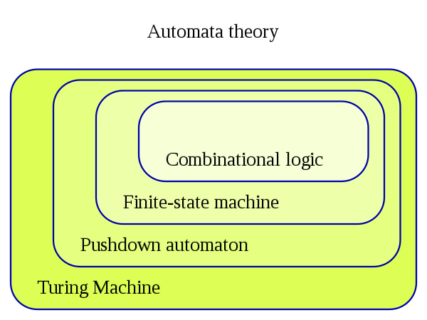
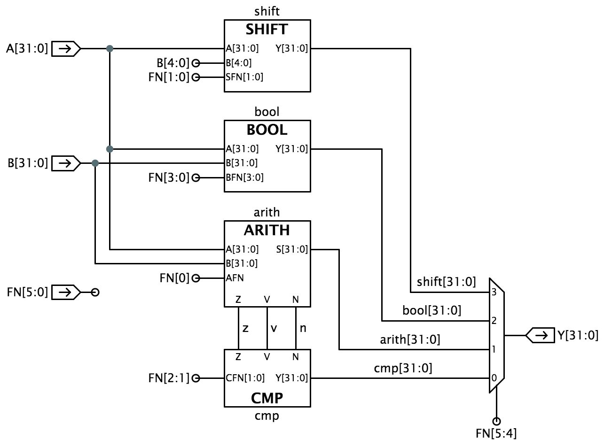
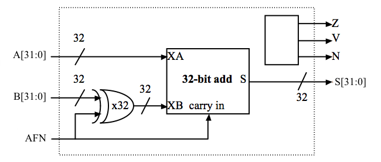

# <u>L1. Basics of Information</u>

## from atoms to Amazon

- Abstraction: Cloud
	- Parallelism & communication
- Abstraction: Virtual Machines 
	- Virtual Memory
		Operating System 
- Abstraction: Programming languages
	- Interpretation & Compilation
		Data and Control structures
- Abstraction: Instruction set + memory
	- Programmable architectures
		FSMs + Datapaths
- Abstraction: Bits, Logic gates
	- Digital Circuits
- Abstraction: Lumped component model 
	- Devices
- Abstraction: Insulator, conductor, semiconductor
	- Materials 
		Atoms

### The Power of Engineering Abstractions 

- Good abstractions allow us to reason about behavior while shielding us from the details of the implementation. 
- Corollary: implementation technologies can evolve while preserving the engineering investment at higher levels. 
- Leads to hierarchical design: 
	- Limited complexity at each level ⇒ shorten design time, easier to verify 
	- Reusable building blocks 

## What is “Information”? 

### Information

n. Data communicated or received that resolves uncertainty about a particular fact or circumstance. 

### Quantifying Information (Claude Shannon, 1948)

$$
I\left(x_{i}\right)_{bit}=\log _{2}\left(\frac{1}{p_{i}}\right)
$$

$p_i:\text{ probability of that result is } x_i$
$$
I(\text { data })=\log _{2}\left(\frac{1}{M \cdot(1 / N)}\right)=\log _{2}\left(\frac{N}{M}\right) \text { bits }
$$
$N$ equally probable choices, and you receive data that narrows it down to $M$ choices

### Entropy

In information theory, the entropy H(X) is the average amount of information contained in each piece of data received about the value of X:
$$
H(X)=E(I(X))=\sum_{i=1}^{N} p_{i} \cdot \log _{2}\left(\frac{1}{p_{i}}\right)
$$

## Encodings

### Encodings as Binary Trees 

It’s helpful to represent an unambiguos encoding as a binary tree with the symbols to be encoded as the **leaves**.

### Fixed-length Encodings

If all choices are <u>equally likely</u>, then a fixed-length code is often used.

Entropy: $\sum_{i=1}^{N}(1 / N) \log _{2}\left(\frac{1}{1 / N}\right)=\log _{2}(N)$

## Variable-length Encodings

### Huffman's Algorithm

- Build subtree using 2 symbols with lowest pi 
- At each step choose two symbols/subtrees with lowest pi , combine to form new subtree 
- Result: optimal tree built from the bottom-up 

### Can We Do Better? 

...to encode sequences of choices, not just each choice individually. This is the approach taken by most file compression algorithms…

## Error Detection and Correction 

### HAMMING DISTANCE

The number of positions in which the corresponding digits differ in two encodings of the same length. 

### Single-bit Error Detection 

A **parity bit** can be added to any length message and is chosen to make the total number of “1” bits even (aka “even parity”).

### Detecting Multi-bit Errors 

To detect $E$ errors, we need a minimum Hamming distance of $E+1$ between code words. 

### Single-bit Error Correction

To correct E errors, we need a minimum Hamming distance of $2E+1$ between code words. 

## *Thinking*

- This lecture introduces the representation of information (mainly binary) from its origin.
	- Information entropy Shannon Entropy: the average amount of information contained in each message accepted
	- 2's complement
	- Encoding for unequal probability messages (minimizing information entropy)
	  - Hoffman coding: an entropy coding algorithm for lossless data compression
	- Identification and correction of errors (e.g., NOISE)
	  - Hamming distance
	  - Parity check bits

- 本讲从起因介绍了信息的表示方式（主要是二进制的）
  - 信息熵 Shannon Entropy：接受的每条消息中包含的信息的平均量
  - 2's complement
  - 对于不等概率信息的编码（尽量减少信息熵）
  	- 霍夫曼编码：一种用于[无损数据压缩](https://zh.wikipedia.org/wiki/无损数据压缩)的[熵编码](https://zh.wikipedia.org/wiki/熵编码)算法
  - 错误（如noise）的识别和纠正
  	- 汉明距离
  	- 奇偶校验位

# <u>L02: The Digital Abstraction</u>

### What makes a good bit?

- cheap, small
- stable
- ease of manipulation

Electricity: voltages, currents, phase, frequency

we use **voltages**

## Representing Information with Voltage

16-bit Dax

Anolog way

### noise/error toleration

- from anolog to digital

### Using Voltages "Digitally"

- Key idea: encode only one bit of information: 2 values “0”, “1” 

## Combinational device

- Static discipline
	- one or more digital inputs
	- one or more digital outputs
	- a functional specification
		- that details the value of each output for every possible combination of valid input values
		- e.g. truth table
	- a timing specification
		- consisting (at minimum) of an upper bound t~PD~ on the required time for the device to compute the specified output values from an arbitrary set of stable, valid input values 

### A Combinational Digital System 

- A set of interconnected elements is a combinational device if
	- each circuit element is combinational
	- every input is connected to exactly one output or to some vast supply of constant 0’s and 1’s
	- the circuit contains no directed cycles

## Dealing with Noise

### Where Does Noise Come From?

- Parasitic resistance, inductance, capacitance
	- IR drop, L(dI/dt) drop, LC ringing from current steps
- Imprecision of component values
- Environmental effects
- ...

### Noise Margins

- digital output: “0” ≤ V~OL~, “1” ≥ V~OH~
- digital input: “0” ≤ V~IL~, “1” ≥ V~IH~
- V~OL~ < V~IL~ < V~IH~ < V~OH~
-   

## Voltage Transfer Characteristic (VTC)

- A Buffer 

- Forbidden Zones
	- Static Discipline requires that the VTC avoid the shaded regions, which correspond to valid inputs but invalid outputs. 
- Note the VTC can do anything when V~IL~ < V~IN~ < V~IH~
- Combinational devices must have GAIN > 1 and be NONLINEAR.
	- Note that the center white region is taller than it is wide (V~OH~-V~OL~ > V~IH~-V~IL~).
	- Corollary: one cannot build combinational logic out of resistors and capacitors and inductors since they are not devices with gain (they are linear)

## *Thinking*

- This lecture introduces the physical representation of information (mainly bits) from the origin.
  - Using voltage representation
  	- forbidden zone: avoid confusion between 0 and 1
  	- noise margins: the output is more strict than the input to cope with noise
  	- Combinational Device
  		- Static Discipline
  - Voltage Transfer Characteristic (VTC)

- 本讲从起因介绍了信息（主要是比特）的物理表示方式
  - 使用电压表示
  	- 禁止区域 forbidden zone：避免0和1之间的混淆
  	- noise margins：输出比输入更严格的标准来应对噪音
  	- Combinational Device
  		- Static Discipline
  - VTC

# <u>L03: CMOS Technology</u>

### Combinational Device Wish List 

- Design our system to tolerate some amount of error 
	- Add positive noise margins
	- VTC: gain>1 & nonlinearity 
- Lots of gain
	- big noise margin 
- Cheap, small
- Low Dissipation
	- Changing voltages will require us to dissipate power, but if no voltages are changing, we’d like zero power dissipation 

## MOSFET

### metal-oxide-semiconductor field-effect transistors

- L: 7 nano-meters

### FETs as Switches

### FETs Come in Two Flavors

- NFET
	- n-type source/drain diffusions in a p-type substrate. Positive threshold voltage; inversion forms ntype channel 
- PFET
	-  p-type source/drain diffusions in a n-type substrate. Negative threshold voltage; inversion forms p-type channel. 
- The use of both NFETs and PFETs – complimentary transistor types – is a key to CMOS ( complementary MOS) logic families. 

## CMOS

- model the behavior of the mosfets as simple voltage-controlled switches:
	- Rule #1: only use NFETs in pulldown circuits
	- Rule #2: only use PFETs in pullup circuits

### Complementary pullups and pulldowns

the pulldown should be “on” when the pullup is “off” and vice versa.

### CMOS PROS

- high gain VTC
	- great noise margins
- V~OL~ ~ 0V, V~OH~ ~ V~dd~
	- no static power

### CMOS complements

### General CMOS Gate Recipe

1. Figure out the pullup network that does what you want

	- e.g. $F=\bar{A}+\bar{B} \cdot \bar{C}$
		(Determine what combination of inputs generates a high output)
	- ​	
		

2. Walk the hierarchy replacing nfets with pfets, series subnets with parallel subnets, and parallel subnets with series subnets

	-   ​	

3. Combine pfet pullup network from Step 1 with nfet pulldown network from Step 2 to form a fully-complementary CMOS gate.

	-   ​	

### CMOS Timing Specifications

- Propagation Delay
	- t~PD~: An UPPER BOUND on the delay from valid inputs to valid outputs.
	-   

- Contamination Delay
	- t~CD~: A **LOWER BOUND** on the delay from any invalid input to an invalid output
	- Default (conservative) spec: t~CD~ = 0
	-   

## *Thinking*

- This lecture introduces the hardware unit that meets the VTC (voltage transfer curve): CMOS (complementary metal-oxide-semiconductor)
  - Essentially a voltage control switch, nFET high voltage on, pFET high voltage off, pulldowns and pullups need to be complementary (otherwise may short circuit), and pulldown using nFET, pullup using pFET (otherwise does not meet the VTC)
  - Due to the above agreement, CMOS Gates have to be reversed naturally. Any input from 0 to 1 cannot change the output from 0 to 1, the output can only be maintained or changed from 1 to 0
  - Propagation delay and contamination delay

- 本讲介绍了满足VTC（voltage transfer curve）的硬件单元：CMOS（互补式金属氧化物半导体场效应管）
  - 本质上是电压控制开关，nfet高电压时开，pfet高电压时关，pulldowns和pullups需要是互补的（否则可能短路），且pulldown使用nfet，pullup使用pfet（否则不满足VTC）
  - 由于以上协定，CMOS Gates 天然得是反向的，任意input从0变到1无法将output从0变到1，只有可能维持output或将output从1变到0
  - 传播延迟和污染延迟

# <u>L04: Synthesis of Combinational Logic</u>

### Functional Specifications

- truth tables
	- a concise description of the combinational system’s function. 
- Boolean expressions
	- an algebra whose operations are AND (multiplication), OR (addition), and inversion (overbar). 

## A Design Approach

1. Write out our functional spec as a truth table 
2. Write down a Boolean expression with terms covering each ‘1’ in the output
	- This approach will always give us Boolean expressions in a particular form: SUM-OF-PRODUCTS 
	- e.g. $\mathrm{Y}=\bar{\mathrm{C}} \bar{\mathrm{B}} \mathrm{A}+\bar{\mathrm{C}} \mathrm{BA}+\mathrm{CB} \bar{\mathrm{A}}+\mathrm{CBA}$
3. Sum-of-products Building Blocks
	- INVERTER 
	- AND 
	- OR 

- ANDs and ORs with > 2 Inputs
	- Associative 

## More Building Blocks

- Inverted 
	- NAND 
	- NOR 
	- CMOS gates are naturally inverting. Want to use NANDs and NORs in CMOS designs… But NAND and NOR operations are not associative
		- Faster
		- Universal
			- Any logic function can be implemented using only NANDs (or, equivalently, NORs)
		- Non-associative $\longrightarrow$ Demorgan's Laws
			- $\overline{A} \cdot \overline{B}=\overline{A+B}$
			- $\overline{A}+\overline{B}=\overline{A \cdot B}$
		- Wide NANDs and NORs 
			- see sildes page 10
- XOR 
	- implementing parity and arithmetic logic
	- Also used as a “programmable inverter”: if A=0, Z=B; if A=1, Z=~B
	- Associative

## Boolean Minimization

$$
\begin{gathered}
Y=\bar{C} \bar{B} A+C B \bar{A}+C B A+\bar{C} B A \\
Y=\bar{C} \bar{B} A+C B+\bar{C} B A \\
Y=\bar{C} A+C B
\end{gathered}
$$

## Karnaugh Maps

- Implicant (size: power of 2) to cover all 1's
- Prime Implicants, Glitches & Leniency 
	- To make the circuit lenient, include product terms for ALL prime implicants

##  Multiplexer

-   ​	
- Leniency 
- systematic implementation of any logic
	- e.g. FPGA (Field Programmable Gate Array)

## Decoder

- Read-only Memory (ROM)
	-   
	- e.g. BIOS

## *Thinking*

- This presentation introduces combinational logic, which consists of various logic gates
  - CMOS is naturally inverted, so the inverted logic gates NAND and NOR are faster, but they do not conform to the law of union and require the use of De Morgan's law.
  - Simplification using Boolean algebra and De Morgan's law
  - Boolean expressions are generated from truth tables using Karnaugh Maps
- Multiplexer can be used to implement any logic
- Decoder is the ROM implementation

- 本讲介绍了组合逻辑电路（combinational logic），由各种逻辑门构成
  - CMOS天然是反向的，因此反向逻辑门NAND和NOR更快速，但它们不符合结合律，需要使用的摩根定律
  - 使用布尔代数和德摩根定律进行简化
  - 使用卡诺图（Karnaugh Maps）从真值表生成布尔表达式
- Multiplexer可以用来实现任何逻辑
- Decoder是ROM的实现方式

# <u>Lab1. CMOS Technology</u>

### Problem1

Moral of the story: by sizing the MOSFETs so that the VTC is centered, we maximize the noise immunity of the inverter.

## *Thinking*

- This lab mainly exercises the second and third lectures on VTC and MOSFETs
  - p1 describes how to maximize the noise immunity of the inverter
  - p2 introduces the determination of propagation delay and contamination delay on the voltage map
  - p3 describes why pullup must use pFET and pulldown must use nFET
    - nFET used in pullup causes a reduction in the maximum value of the output voltage
  - p4 practices how to design CMOS (Complementary MOS) logic gates using as few MOSFETs as possible
    - Tip: If it is difficult to generate high voltages using pullups, design a complementary logic gate and design pulldowns first and finally connect that logic gate to an inverter

- 这个lab主要练习了第二讲和第三讲的内容，VTC和MOSFET
  - p1介绍了如何将inverter的抗噪能力最大化
  - p2介绍了在电压图上确定传播延迟和污染延迟
  - p3介绍了为什么pullup必须用pfet而pulldown必须用nfet
    - nfet用在pullup中会造成输出电压最高值的降低
  - p4练习了如何使用尽量少的MOSFETs设计CMOS（Complementary MOS）逻辑门
    - 技巧：如果难以使用pullups产生高电压，则设计一个complementary的逻辑门，并首先设计pulldowns，最后将该逻辑门连接INVERTER

# <u>Lab2. CMOS Adder</u>

- This lab goes into some further details about CMOS, practicing techniques for constructing logic gates from CMOS, and techniques for constructing combinational logic from logic gates
  - p4 requires the construction of a 3-bit full adder
    - For the tradeoff between size and speed, since the sum bit S does not affect the ripple, size is the most critical, while the carry bit C affects the ripple and is the most significant factor in the overall propagation delay, so it is optimized using the inverse logic gate whenever possible
      - S uses two XORs
      - C can use 3 AND2 and 1 OR3, but used 3 NAND2 and 1 NAND3 for optimization (actually, size is also small)
    - For the XOR2 design, not 11 and 00 (using 10 MOSFETs)
      - $\operatorname{XOR}(A, B)=\overline{A \cdot B+\bar{A} \cdot \bar{B}}=\overline{A \cdot B+\overline{A+B}}=\overline{A \cdot B+\operatorname {NOR}(A, B)}$

- 这个lab进一步介绍了一些CMOS的细节，练习了由CMOS构成逻辑门的技巧，以及由逻辑门构成combinational logic的技巧
  - p4需要构建一个3比特全加器
    - 对于size和speed的权衡，由于和位S不影响ripple，因此size是最关键的，而进位C影响ripple，是整体传播延迟的最主要因素，因此尽可能使用反向逻辑门进行优化
      - S使用两个XOR
      - C可以使用3个AND2和1个OR3，但使用了3个NAND2和1个NAND3进行优化（实际上size也是小的）
    - 对于XOR2的设计，不是11和00（使用10个MOSFETs）
      - $\operatorname{XOR}(A, B)=\overline{A \cdot B+\bar{A} \cdot \bar{B}}=\overline{A \cdot B+\overline{A+B}}=\overline{A \cdot B+\operatorname{NOR}(A, B)}$

# <u>L05: Sequential Logic</u>

### Digital State

### Memory: Using Capacitors

-   ​	
- Pros
	- compact - low cost/bit
- Cons
	- complex interface
	- stable? (noise, ...)
	- it leaks! $\longrightarrow$ refresh
- e.g. Dynamic RAM (DRAM)

### Memory: Using Feedback

-   ​	

### Settable Memory Element

- Latch: using a leninet MUX 
	-   ​	

## D Latch

- Circuit 
- Schematic Symbol 

### Leniency

-   
- Assume LENIENT Mux, propagation delay of T~PD~
- Then output valid when
	- G=1, D stable for T~PD~, independently of Q’ ; or 
	- Q=D stable for T~PD~ , independently of G; or 
	- G=0, Q stable for T~PD~ , independently of D 

### Dynamic Discipline

-  
- T~SETUP~ = 2T~PD~: interval prior to G transition for which D must be stable & valid
- T~HOLD~ = T~PD~: interval following G transition for which D must be stable & valid  

## D Register (flip-flop)

- 2 Latches：master and slave
-  
- Schematic Symbol 

### Timing

-  
- t~PD~: maximum propagation delay, CLK→Q
- t~CD~: minimum contamination delay, CLK→Q 
- t~SETUP~: setup time 
	- guarantee that D has propagated through feedback path before master closes
- t~HOLD~: hold time 
	- guarantee master is closed and data is stable before allowing D to change 

## Single-clock Synchronous Circuits

-   ​	
- Single-clock Synchronous Discipline
	- No combinational cycles
	- Single periodic clock signal shared among all clocked devices
	- Only care about value of register data inputs just before rising edge of clock 
	- Period greater than every combinational delay + setup time 
	- Change saved state after noise-inducing logic transitions have stopped! 

### Timing in a Single-clock System

-  
-  
- t~1~ = t~CD,reg1~ + t~CD,L~ ≥ t~HOLD,reg2~
- t~2~ = t~PD,reg1~ + t~PD,L~ + t~SETUP,reg2~ ≤ t~CLK~

## Sequential Circuit Timing

- Constraints on t~CD~ for the logic?
	- t~CD,L~ ≥ t~H,R~ - t~CD,R~
- Minimum clock period?
	- t~CLK~ ≥ t~PD,R~ + t~PD,L~ + t~S,R~
- Setup, Hold times for Inputs?
	- t~S,INPUT~ = t~PD,L~ + t~S,R~ 
		(to fulfill the setup time of the register)
	- t~H,INPUT~ = t~H,R~ - t~CD,L~
		(to fulfill the hold time of the register)

## *Thinking*

- This lecture introduces how to store state and use the existing state for the next operation (sequential logic), mainly to solve the memory and its implementation of read and write
  - Using capacitive DRAM
  - Using feedback -- Latch -- x2 (master/slave): Registers
  - Timing
    - D Latch (D is named by data input)
      - setup: double the propagation delay so that the output (Q) is stable, then the feedback (Q') is stable
      - hold: the propagation delay, waiting for the G (gate, i.e., clock) to change stable
    - (Edge-Triggered) D Register
      - T~PD~, T~CD~
      - T~SETUP~: ensure D has propagated through the feedback route (Q and Q') before master is closed
      - T~HOLD~: Before D changes, make sure master is closed, and data is stable (after clock interference)
    - Single-clock System
      - t~CD,reg1~ + t~CD,L~ ≥ t~HOLD,reg2~
        - After the rising edge of CLK (while master is off), the sum of the contamination delay of register 1 and logic block should be greater than or equal to the hold of register 2 to ensure that the Q of master in register 2 (after clock interference) has been stabilized
      - t~PD,reg1~ + t~PD,L~ + t~SETUP,reg2~ ≤ t~CLK~
        - After the rising edge of CLK, the sum of the propagation delay of register 1 and logic block plus the setup of register 2 should be less than the clock period to ensure that the master's D in register 2 has propagated through the feedback route (Q and Q') when CLK is turned on again
    - Sequential Circuit
      - equivalent to Single-clock System in which registers 1 and 2 are assumed by a single register
      - t~S,INPUT~ = t~PD,L~ + t~S,R~ 
        - The input setup should be greater than or equal to the propagation delay of the logic block plus the setup of the registers to ensure the setup time of register D
      - t~H,INPUT~ = t~H,R~ - t~CD,L~
        - The input hold should be greater than or equal to the hold of the register minus the contamination delay of the logical block to ensure the hold time of register D

- 这一讲主要介绍了如何进行状态的存储，以及使用现有状态进行下一步的操作（sequential logic），主要在于解决存储器及其读写的实现方式
  - 使用电容 DRAM
  - 使用反馈——触发器（Latch）——x2（master/slave）：寄存器
  - Timing 定时
    - D Latch（D是由data input命名的）
      - setup：两倍的propagation delay，使得输出（Q）稳定，然后反馈（Q’）稳定
      - hold：一倍的propagation delay，等待G（gate，即clock）改变的稳定
    - (Edge-Triggered) D Register
      - T~PD~, T~CD~
      - T~SETUP~：在master关闭以前，保证D已经传播通过反馈路线（Q和Q’）
      - T~HOLD~：在D改变以前，保证master关闭且（clock干扰后的）数据稳定
    - Single-clock System
      - t~CD,reg1~ + t~CD,L~ ≥ t~HOLD,reg2~
        - CLK的rising edge（同时master关闭）后，寄存器1和逻辑块的污染延迟之和要大于等于寄存器2的hold，保证寄存器2中master的（clock干扰后的）Q已经稳定
      - t~PD,reg1~ + t~PD,L~ + t~SETUP,reg2~ ≤ t~CLK~
        - CLK的rising edge后，寄存器1和逻辑块的传播延迟加上寄存器2的setup之和，要小于时钟周期，保证CLK再次打开时，寄存器2中master的D已经传播通过反馈路线（Q和Q’）
    - Sequential Circuit
      - 相当于Single-clock System中的寄存器1和2都由单个寄存器承担
      - t~S,INPUT~ = t~PD,L~ + t~S,R~ 
        - 输入的setup要大于等于逻辑块的传播延迟加上寄存器的setup，保证寄存器D的setup时间
      - t~H,INPUT~ = t~H,R~ - t~CD,L~
        - 输入的hold要大于等于寄存器的hold减去逻辑块的污染延迟，保证寄存器D的hold时间

# <u>L06: Finite State Machines</u>

## Finite State Machine (FSM)

- k STATES: S~1~ … S~k~ (one is “initial” state) 
- m INPUTS: I~1~ … I~m~ 
- n OUTPUTS: O~1~ … O~n~ 
- Transition Rules: s’(s, I) for each state s and input I 
- Output Rules: Out(s) or Out(s, I) for each state s and input I 

### State Transition Diagram

### Valid State Diagrams

- mutually exclusive
- collectively exhaustive 

### State Transition Diagram as a Truth Table

## Hardware

### Housekeeping Issues

1. Initialization? Clear the memory?
2. Unused state encodings?
	- waste ROM (use gates) 
	- what does it mean? 
	- can the FSM recover?
3. Choosing encoding for state?
4. Synchronizing input changes with state update? 

### Alternative way

### FSM Equivalence

- FSMs are EQUIVALENT iff every input sequence yields identical output sequences. 
- Equivalent states are states that have the same transitions and outputs

## RoboAnt

- The Transition Table
	-   ​	
- Ant Schematic
	-   ​	

## Synchronizer

- MUX's Metastable State
- Solution: Delay Increases Reliability
	- Quarantine time reduces p(metastable) 

## *Thinking*

- This lecture introduces finite state machines (FSM) using sequential logic, which is a higher level abstraction.
  - ​	
  - The tool used is the State Transition Diagram
    - Moore machine or Mealy machine (6.004 uses Moore)
  - Hardware is implemented by Registers and Combinational logic
    - The latter can be a ROM implemented by Decoder or others
  - We assume that the input and register clocks are synchronized, but this is not necessarily the case in the real world
    - Using D Register as a synchronizer, there is a very small probability that the Q of D Latch is invalid due to the existence of a Metastable State (Q and Q' are equal but not valid inputs and outputs) in the VTC of MUX.
    - However, since the Metastable state is not stable, increasing the number of D Register as a synchronizer makes the probability that the input value into the Combinational logic circuit is metastalbe extremely low.
- I have a personal question, that is, if the input duration is long, then the rising edge of each clock will change the current state and generate the next state together with the input, and then generate a new current state at the next rising edge, so the frequency of the input and the frequency of the clock need to be equivalent
  - RoboAnt is like this, just set the sensor input frequency and the clock frequency can be the same
  - But what about the password lock? Is it better to register the clock and the input signal related?

- 本讲介绍了使用sequential logic的有限状态机（FSM），是一个更高级的抽象。
  -   借助的工具是State Transition Diagram
    - Moore machine或Mealy machine（6.004使用Moore）
  -   硬件通过Registers和Combinational logic实现
    - 后者可以是由Decoder实现的ROM，也可以是其他
  -   我们假设输入和register的clock是同步的，但现实世界并不一定如此
    - 使用D Register做为同步器，由于MUX的VTC存在一个Metastable State（Q和Q’相等但不是有效的输入输出），因此有极小的概率D Latch的Q为无效电压值
    - 但由于Metastable state并不稳定，因此增加D Register的数量作为同步器，使得进入Combinational logic电路的输入值为metastalbe的概率极低
- 个人有一个疑问，即假若输入持续时间较长，那么每个clock的rising edge都会改变当前状态，并和输入一起产生下一个状态，再在下次rising edge时产生新的当前状态，因此输入的频率和clock的频率需要是相当的
  - RoboAnt即为如此，只需设置sensor输入的频率和clock的频率相同即可
  - 但密码锁呢？最好是register的clock和输入信号相关？

# <u>L07: Performance Measures</u>

- Latency vs. Throughput

## Pipeline

### Conventions

- Definition
	- A well-formed K-Stage Pipeline (“K-pipeline”) is an acyclic circuit having exactly K registers on <u>*every*</u> path from an input to an output. 
- Composition Convention
	- Every pipeline stage, hence every K-Stage pipeline, has a register on its OUTPUT (not on its input). 
- Always
	- The CLOCK common to all registers must have a period sufficient to cover propagation over combinational paths PLUS (input) register t~PD~ PLUS (output) register t~SETUP~. 
	- t~CLK~ = t~PD,REG~ + t~PD~ of slowest pipeline stage + t~SETUP~
- Latency
	- K times the period of the system’s clock. 
	- L = K*t~CLK~ = K / T 
- Throughput
	- frequency of the clock
	- T = 1/t~CLK~

### A Pipelining Methodology

- Contouring
- Pipelined Components

### Bottleneck: Circuit Interleaving

-   ​	
- N-way interleaving is equivalent to N pipeline Stages... 

### Combine Techniques

-  

### Control Structure Alternatives

## *Thinking*

- This lecture describes how to use register stored procedure results to implement a pipeline, a relatively simple concept with some technical details
  - pipelining can increase throughput but generally increases latency
  - using contour for stage design
  - bottlenecks are solved by circuit interleaving (multiple compute units for stages with long latencies)
    - N interleaving is equivalent to an N-stage pipeline (requires N contours to pass through)

- 本讲介绍了如何使用register存储过程结果从而实现pipeline（流水线），是一个相对简单的概念，有一些技术的细节
  - pipelining可以增加吞吐量（throughput），但是一般会增加延迟（latency）
  - 使用contour进行级（stage）的设计
  - 瓶颈通过circuit interleaving进行解决（延迟长的级设置多个计算单元）
    - N路交错相当于N级流水线（需要有N个contour穿过）

# <u>L08: Design Tradeoffs</u>

### Optimization metrics

1. Area of the design
2. Throughput
3. Latency
4. Power consumption
5. Energy of executing a task

## Power

### CMOS Power Dissipation

- CMOS Static Power Dissipation
- CMOS Dynamic Power Dissipation
	- f N C V~DD~^2^ per chip ~ 100W：
		f ~ 1GHz = 1e9 cycles/sec
		N ~ 1e8 changing nodes/cycle 
		C ~ 1fF = 1e-15 farads/node
		V ~ 1V 

### Fewer Transitions → Lower Power

Variations: Dynamically adjust t~CLK~ or V~DD~ (either overall or in specific regions) to accommodate workload. 

## Speed

### Improving Speed: Adder Example 

- Ripple Carry Adder
	- $\mathrm{t}_{\mathrm{PD}}=(\mathrm{N}-1)^{*}\left(\mathrm{t}_{\mathrm{PD}, \mathrm{NAND} 3}+\mathrm{t}_{\mathrm{PD}, \mathrm{NAND} 2}\right)+\mathrm{t}_{\mathrm{PD}, \mathrm{XOR}} \approx \Theta(\mathrm{N})$
- Carry Select Adder
	- $\Theta(\log N)$
- Wanted: Faster Carry Logic!
	- Generate and Propagate

## Binary Multiplication

- Increase Throughput With Pipelining
	- “Carry-save” Pipelined Multiplier 
- Reduce Area With Sequential Logic

## *Thinking*

- This presentation focuses conceptually on some of the trade-offs in design between speed, area, and energy consumption.
  - Energy consumption
    - The energy consumption of CMOS has already reached a threshold, and any higher would even melt some of its own material
    - Power consumption can be reduced by turning off certain circuits that are not in use or by extending their clocks
  - Speed
    - Speed can be increased by the design of the computation architecture
      - For example, the adder design
        - By calculating two possible carry values in advance corresponding to the high bit addition, and then choosing one of them after the low bit is completed, but the area is very large
        - Increase the speed of the calculation of the carry by designing the computation architecture
  - Trade-off between speed and area
    - For example, the design of a multiplier
      - If a large number of multipliers are needed for fast completion, the design increases the throughput by pipelining
      - If the size of the instrument is limited, a large number of multiplications need to be done at the same time, and the speed requirement is not too high, the same function can be done iteratively using the same circuit by sequential logic, and the process data can be recorded by register.

- 本讲主要概念性的介绍了设计中的一些权衡，在速度、面积和能耗之间：
  - 能耗
    - CMOS的能耗已经达到了阈值，再高所散发的热量甚至会把自身的某些物质融化
    - 可以将某些暂时不用的电路关闭，或延长其时钟以减少能耗
  - 速度
    - 通过计算结构（computation architecture）的设计增加速度
      - 例如adder的设计
        - 通过提前计算两个可能的carry的值对应的高位加法，待低位完成后选择其一，但面积极大
        - 通过计算结构设计增加carry计算的速度
  - 速度和面积的权衡
    - 例如multiplier的设计
      - 如果需要大量乘法的快速完成，则通过pipelining进行设计增加吞吐量
      - 如果仪器尺寸有限，需要同时完成大量乘法，但不需要太高的速度，则通过sequential logic将同样的功能使用同一个电路迭代完成，并通过register记录过程数据

# <u>Lab3. Finite State Machines</u>

### Problem 3. Design problem: Well-formed parenthesis string checker

> ...an unlimited memory capacity obtained in the form of an infinite tape marked out into squares, on each of which a symbol could be printed. At any moment there is one symbol in the machine; it is called the scanned symbol. The machine can alter the scanned symbol and its behavior is in part determined by that symbol, but the symbols on the tape elsewhere do not affect the behavior of the machine. However, the tape can be moved back and forth through the machine, this being one of the elementary operations of the machine. Any symbol on the tape may therefore eventually have an innings. (Turing, 1948)

- We now refer to this device as a Turing Machine (TM) and use it as our definition for what it means to be computable, i.e., we believe (Church's Thesis) that a function is algorithmically computable if and only if it's computable by a TM.

## *Thinking*

- This lab exercises some concepts of finite state machines and reviews some timing problems of sequential logic.
- An interesting element is the simulation of Turing machines. Since a finite state machine is the functional equivalent of a Turing machine with no storage, it provides some initial insight into the concept of computability.
  - The strength of computers lies in the large amount of computation and the processing of large amounts of data, so problems that look simple to the human eyes take more time and seemingly complex logic and steps for computers to handle.
  - But, this does not mean a disadvantage for the problem because the same logic can be used to deal with all similar problems without the need to use different methods for the different complexity of the problem classification (generality)
- The fourth problem was to design a sequential logic circuit using jade, which was relatively easy to implement because of the higher-level components: register, mux, ROM, etc., but some technical details stuck for a long time.
  - 10-minute Rule! to Scientific Method!

- 这个lab练习了有限状态机的一些概念，也复习了一些sequential logic的timing问题。
- 一个有趣的内容是对于图灵机的模拟，由于有限状态机的功能相当于缺少存储的图灵机，因此可以初步了解一些可计算性的概念。
  - 计算机的优势在于大量计算，以及对于大量数据的处理，因此人眼看起来简单的问题计算机反而需要花费更多的时间，和看似复杂的逻辑和步骤来处理
  - 但这并不意味着对于该问题的劣势，因为同样的逻辑可以用在处理所有类似的问题上，而不需要针对问题的不同复杂度的分类采用不同的方法（通用性）
- 第四个问题是使用jade设计一个sequential logic的电路，由于有较高层级的元件：register，mux，ROM等，因此实现起来比较简单，但是一些细节的技术问题卡了很久。
  - 10-minute Rule! to Scientific Method!

对于图灵机，第二天又尝试把states从3个变为2个，其实最终的思路过程中想到过，但是没有去尝试，即左括号和右括号都是从左到右寻找：这样可以避免寻找左括号时左右都会碰到边界的问题（而左边界并不能确定平衡），而这个问题正是各种尝试中都碰到的。

这样会导致同一个状态左右移动的过程中同一个符号不同的行为，只需要在左右移动中修改这个符号即可，不同的符号对应左右移动的不同操作。

这其中思考到一个东西方哲学的问题，东方的哲学应对世界的复杂性，采用的方式是混沌模糊（一生二，二生三，三生万物），西方的哲学采用的方式是原子化、简单化（世界是由水/火/数/原子组成的）。考虑到解决问题的思路，一种方式是混沌，在混沌中寻找可能；另一种方式是科学方法，study——hypothesis——experiment——repeat（记录你的假设和实验，并进行分析）。(和设计sequential logic时碰到的问题有相似之处)

# <u>Lab4. 32-bit ALU</u>

## *Thinking*

- This lab presents the design and implementation of a 32-bit Arithmetic Logic Unit (ALU), which is the essential component of the CPU.
  - The ALU itself has an interesting design, with a 6-bit FN selection operation, where the first 2 bits determine the selection of the four units and the last four bits determine the operations within the four units.
    - ​	
  - The use of XOR as an additive and subtractive transformation
    - ​	
  - MUX has a large number of applications and is the primary unit in both BOOL and SHIFT
    - BOOL: 
  - Boolean algebra is also an important digital circuit design tool
    - Adder overflow or not: $V=X A_{31} \cdot X B_{31} \cdot \overline{S_{31}}+\overline{X A_{31}} \cdot \overline{X B_{31}} \cdot S_{31}$
- The main takeaway is still the big picture obtained from building a fully functional computer using voltage-controlled switches (MOSFETs): CPU (with ROM, Register), DRAM, etc.

- 这个lab介绍了32位的算术逻辑单元（Arithmetic Logic Unit）的设计和实现，它是CPU的基本部件。
  - ALU本身的设计就很有趣，通过6位FN选择运算，前2位决定四个单元的选择，后四位决定四个单元内的操作。
  - XOR作为加减法转换的使用
  - MUX有大量的应用，在BOOL和SHIFT中都是主要的单元
  - 布尔代数也是重要的数字电路设计工具
    - 加法器是否溢出：$V=X A_{31} \cdot X B_{31} \cdot \overline{S_{31}}+\overline{X A_{31}} \cdot \overline{X B_{31}} \cdot S_{31}$
- 最主要的收获还是使用电压控制开关（MOSFETs）构建出完整功能的计算机：CPU（包含ROM，Register），DRAM等，从中获得的big picture。

